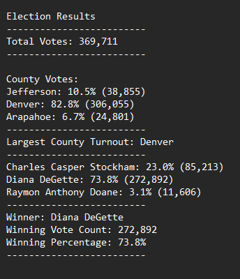
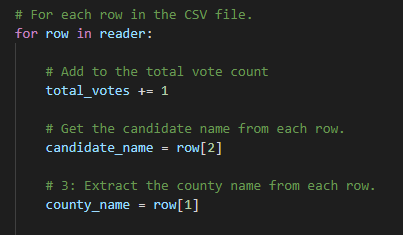
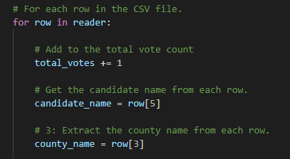
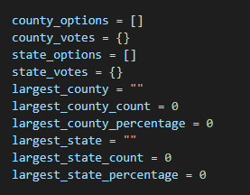
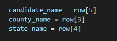
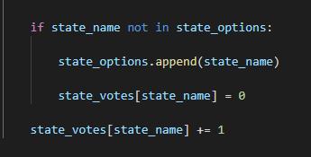

# Election-Analysis

## Overview of the Election Audit

### Purpose

- A Colorado Board of Elections employee requested my help to conduct an election audit of a recent local congressional election. The tasks to be completed for this election audit were:
    1. Calculate the total number of votes cast.
    2. Get a complete list of candidates who received votes.
    3. Calculate the total number of votes each candidate received.
    4. Calculate the percentage of votes each candidate won.
    5. Determin the winner of the election based on popular vote.

- The board additionally requested an overview and analysis of voter turnout by county, listed both as a percentage and total votes per county, as well as what county had the highest voter turn out.

- Output of .txt file:

## Resources
- Data Source: election_results.csv
- Software: Pyton 3.10.1, Visual Studio Code, 1.65.2

### Election-Audit Results

- Summary of the election:

    - Total votes: 369,711

- Votes by County:
    - Jefferson: 10.5% (38,855)
    - Denver: 82.8% (306,055)
    - Arapahoe: 6.7% (24,801)

- County with the highest turnout: Denver

- Votes by Candidate:
    - Charles Casper Stockham: 23.0% (85,213)
    - Diana DeGette: 73.8% (272,892)
    - Raymon Anthony Doane: 3.1% (11,606)

- Winner by popular vote:
    - Winner: Diana DeGette
    - Winning Vote Count: 272,892
    - Winning Percentage: 73.8%
    
### Election-Audit Summary

 - The python script included in this repository could be modified to process other .csv election result datasets by adjusting the script to inspect the correct column in the desired file.

 - For example, our script currently looks like this:
 
 

 - We can adjust the index number to reflect the needs of a different .csv file in the Resources folder like so:
 
 

 - The script could also be altered to track a national election by adding a states set of variables that is similar to our county variable set like so:

 

 - And we would just need to adjust our for loop and if statements to account for states now.

 
 
 
